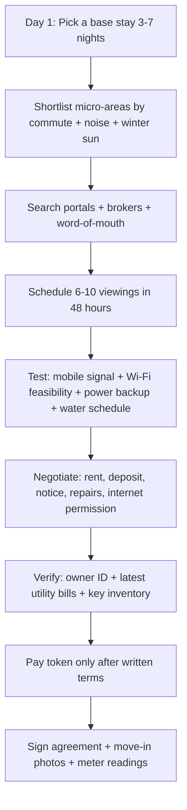

# First 30 Days in Himachal Pradesh: Practical town‑by‑town settling guide for Bir, Dharamshala, McLeodganj, Palampur, Shimla, Solan, Manali, Naggar

## Executive summary

Settling speed in these towns is driven less by “how fast you can find a flat” and more by **how much of the onboarding can be done digitally** (electricity, water, SIM/KYC), plus **how seasonal the rental market is** (tourist towns typically have more short‑term inventory but also more “price rigidity” and landlord rules). Digital enablement is comparatively strong for electricity across the state via online services and consumer portal flows. citeturn23search0turn23search1turn16search8

A practical fastest‑to‑slowest ranking (assuming you are arriving in a normal week, not a festival/peak rush) is:

**Fastest: Solan → Dharamshala → Palampur → Shimla → McLeodganj → Bir → Naggar → Manali**

The biggest recurring friction points to plan around are:

- **Proof of address** for onboarding (SIM KYC, LPG connection/transfer, sometimes broadband). DoT/KYC tightening means authorised points of sale must follow strict onboarding processes and capture subscriber details properly. citeturn12search52turn12search7  
- **Water onboarding and reliability**: Jal Shakti online water‑connection workflows exist statewide with a stated time limit framework (Public Service Guarantee). Shimla’s supply and billing are handled via SJPNL (separate from Jal Shakti workflows); and Shimla periodically faces summer supply stress, worsened by tourist inflow. citeturn17search2turn17search8turn18search5turn18search2  
- **Tourist‑linked volatility** (especially Manali/Naggar/McLeodganj): seasonal crowding increases short‑term rents, reduces negotiation leverage, and can slow practical errands (traffic, parking, shop queues). Manali explicitly reports a large floating population during tourist season. citeturn11search11turn18search5  
- **Hills = last‑mile variability**: even where the operator offers “24‑hour install”, actual fibre lead time depends on local feasibility, permissions, and technician availability. Airtel and Jio publish “up to 24 hours / within 24 hours in select locations” messaging, but you should still plan a fallback. citeturn3search0turn3search3  

## Assumptions and baseline toolkit

Assumptions are **unspecified** unless you confirm otherwise. Where the path differs, you’ll see two tracks.

**Identity / address assumptions (critical):**
- Track A: You have **Indian ID** (Aadhaar/Driving Licence/Voter ID) and can produce a **local address proof** (rent agreement, landlord letter, utility bill, employer letter). (Most friction‑free.)
- Track B: You are an **OCI / NRI / foreign national residing in India**. LPG forms explicitly accommodate foreign nationals under valid visa / NRIs, but you should expect more scrutiny and fewer “instant” outcomes for SIM and LPG. citeturn6search2turn12search52  

**Your move‑in “go‑bag” (highly practical in Himachal):**
- Printed + PDF copies: ID, passport/visa (if Track B), passport photos, a simple one‑page “tenant profile” (job, income, references). (Landlords often decide based on perceived reliability; having a neat pack accelerates trust.)
- A lightweight **network test kit**: phone hotspot, speed‑test app, and a power bank (so you can test cellular and Wi‑Fi at the property on day one).
- A short list of **non‑negotiables** (quiet hours, power back‑up, pet policy, cooking rules, guests policy) because hill‑town rentals can have “house rules” that are not obvious in listings.

**Key official portals you will reuse in all towns (URLs in code for convenience):**
```text
Electricity (HPSEBL consumer portal): https://cportal.hpseb.in/
HPSEBL tariff schedule page: https://www.hpseb.in/ (Tariff section)

Water (Jal Shakti citizen services): https://iph.hp.nic.in/Citizen/
Jal Shakti department main site: https://jsv.hp.nic.in/

Shimla water & sewerage (SJPNL): https://sjpnl.com/

Airtel broadband: https://www.airtel.in/broadband
JioFiber: https://www.jio.com/fiber

RailWire (customer care shown on partner portal): https://railwire.digitalsolutions.co.in/

Vehicle registration / RTO services: https://parivahan.gov.in/
```

Named organisations in this guide include entity["organization","Himachal Pradesh State Electricity Board Limited","state electricity utility, hp, India"], entity["organization","Jal Shakti Vibhag, Himachal Pradesh","water supply dept, hp, India"], entity["organization","Shimla Jal Prabandhan Nigam Limited","shimla water utility, hp, India"], entity["company","Bharti Airtel","telecom operator, India"], entity["company","Reliance Jio","telecom operator, India"], entity["company","Bharat Sanchar Nigam Limited","state telco, India"], entity["organization","Telecom Regulatory Authority of India","telecom regulator, India"], entity["organization","Department of Telecommunications, India","telecom ministry dept, India"], entity["organization","Ministry of Road Transport and Highways","central transport ministry, India"], and entity["organization","Parivahan Sewa","morth digital portal, India"]. citeturn15search3turn15search0turn0search2turn12search52turn3search0turn3search3turn23search0turn17search0turn18search2  

## Core workflows you will repeat everywhere

### Rental search workflow



Deposit reality check: The Model Tenancy framework discussed in Indian tenancy guides commonly references a **two‑month cap** for residential deposits as a best‑practice benchmark (even if local practice can deviate), so treat anything above that as a negotiation prompt rather than a fixed rule. citeturn8search0turn8search6  
For Himachal rent agreements, stamp duty and documentation expectations vary by tenure; 11‑month agreements are often handled with nominal stamping/notarisation in practice, while longer tenures attract higher duty calculations. citeturn8search14  

### Utilities and ISP onboarding flow

```mermaid
flowchart TD
  A[Move-in day: record current meter readings] --> B[Electricity: stay on landlord meter OR apply name change]
  A --> C[Water: confirm billing owner + supply schedule]
  B --> D[Use HPSEBL portal for service requests]
  C --> E[Jal Shakti portal / municipal form / SJPNL for Shimla]
  D --> F[ISP feasibility check (Airtel/Jio/BSNL/RailWire)]
  F --> G[Submit KYC + schedule installation]
  G --> H[If delayed: mobile hotspot + backup operator]
```

Electricity service standards in Himachal specify delivery timelines (urban/rural/remote) once “codal formalities” and payments are complete; HPSEBL’s published dashboards and reporting repeatedly reflect the same service‑standard time bands. citeturn16search0turn16search1  
Water connections (Jal Shakti) are available through the citizen portal and mobile app ecosystem, with a stated time limit under the Public Service Guarantee framework shown on the department’s dashboard. citeturn17search2turn17search4  

## Town‑by‑town first 30 days guide

Notes for all town tables:
- “Electricity transfer” assumes you actually need a name change. Most tenants simply reimburse bills while the connection stays in the owner’s name (fastest). HPSEBL supports online name/category/load change flows via the consumer portal. citeturn23search0turn16search9  
- Water timelines differ: Shimla uses SJPNL; other towns typically fall under Jal Shakti / ULB processes. citeturn18search2turn17search2  
- Broadband “days” assume line feasibility exists; if last‑mile fibre is missing, your timeline becomes “indefinite until extended”. Operator pages explicitly frame install time as “up to 24 hours / within 24 hours in select locations”, which is not a guarantee in every pin code. citeturn3search0turn3search3  

### Bir

Bir is usually **easy to start living in** (compact, walkable, scooter‑friendly) but **slower to formalise** (best rentals are often found via local networks; last‑mile utilities may be less standardised than municipal towns). Two‑wheeler rentals exist locally, which helps you stabilise quickly while searching for a longer‑term house. citeturn13search16turn13search14  

**Finding a rental (channels, timeline, quirks):** Prioritise local brokers, café noticeboards, and word‑of‑mouth (you can “see and decide” faster). Use entity["company","OLX","classifieds platform, India"], entity["company","99acres","property portal, India"], and entity["company","MagicBricks","property portal, India"] mainly to benchmark pricing and spot outliers; in small towns, listings can be stale. Expect landlords to ask about length of stay, WFH routines, and guest policy; keep your “tenant profile” pack ready. Deposit expectations are negotiable; treat the two‑month benchmark as an anchor for negotiation rather than an automatically enforced cap. citeturn8search0  

**Utilities (electricity/water):** If you rent part of a house, you’ll often stay on the owner’s meter and reimburse. If you need a name change or new connection, HPSEBL supports online service requests and publishes service timelines by area category. citeturn23search0turn16search0  
For water, use Jal Shakti’s citizen portal/app stack for new connections/status; the department dashboard shows the service is processed online and governed by a time‑limit framework. citeturn17search2turn17search4  

**ISP installation:** Start with operator feasibility checks; book the first install slot available and keep a second operator as fallback. Airtel markets “installation in up to 24 hours” in most locations; Jio references same‑day/within‑24‑hours in select locations. citeturn3search0turn3search3  
If fibre doesn’t exist at your lane, ask about local last‑mile providers (often cable‑based) and plan mobile hotspot usage.

**LPG:** For a new domestic connection, keep KYC forms ready and use the government’s MyLPG/PMUY entry points for official forms; BharatGas provides standard declaration formats covering eligibility and identity/address proofs. citeturn7search4turn6search2  
If you already have a connection elsewhere, do a distributor transfer rather than taking a new connection (fewer deposits held up). citeturn6search1  

**SIM/porting:** For porting, TRAI’s published consumer FAQs cover the UPC process (SMS to 1900) and porting timelines (intra‑LSA vs inter‑LSA). citeturn0search2  
Expect KYC rigor at authorised SIM points of sale due to DoT reforms. citeturn12search52turn12search7  

**Local transport:** Scooter rentals are available locally; expect roughly ₹600–₹800/day for scooters from a Bir provider, with a small deposit shown by local rental sites; aggregator listings show similar day‑rent baselines. citeturn13search16turn13search14turn13search18  
Helmet enforcement is strict in Kangra district (reported “no helmet, no fuel” approach), so treat a helmet as non‑optional. citeturn12search0turn12search2  
Foreign licence note: MoRTH states a foreigner can drive in India only with a valid IDP from a Geneva‑Convention country (foreign licence alone is not sufficient). citeturn15search3  

**Furniture:** In Bir, the fastest path is usually “part‑furnished + add essentials” (mattress, desk, chair) via local shops; for second‑hand, filter listings carefully and insist on in‑person inspection before payment.

**Grocery delivery:** Assume app‑based quick‑commerce coverage is variable; if you rely on app delivery, test your address in the first 48 hours. National platforms publish delivery models, but pin‑level coverage is usually app‑gated. citeturn20search3turn20search0  

**Town‑specific 30‑day focus:** Use the universal 30‑day plan below, but in Bir you should front‑load: (i) mobility (scooter), (ii) a reliable hotspot plan, (iii) water/power reality checks at each viewing.

**Expected timelines table (days)**

| Item | Typical expectation |
|---|---|
| Rental secured (longer‑term) | 10–21 |
| Electricity transfer/new connection | 15–30 (area category dependent) citeturn16search0 |
| Water connection (if required) | up to 30 (PSG framework) citeturn17search2turn17search8 |
| ISP install (if feasible) | 1–7 (operator and lane dependent) citeturn3search0turn3search3 |
| LPG transfer/new connection | 7–15 (distributor‑dependent estimate) citeturn5search5turn6search2 |
| SIM (new) / porting | new SIM often same‑day; porting 3–5 working days typical citeturn0search2 |
| Scooter rental | same‑day citeturn13search16 |

**Local contacts / sources to verify (start here):**
- HPSEBL consumer portal (applications, name change, complaints). citeturn23search0turn16search8  
- Jal Shakti citizen services (apply water connection / status). citeturn17search6turn17search2  
- Bir scooter/bike rental (baseline rates & deposits). citeturn13search16turn13search14  
- TRAI MNP consumer FAQs (porting process/timelines). citeturn0search2  

### Dharamshala

Dharamshala is one of the **quickest towns to settle into** on this list because civic contacts are clearly published, online municipal interfaces exist, and the market supports both longer‑term rentals and interim stays. The town’s municipal portal explicitly lists suburbs and civic‑office clusters, which helps you identify practical “errand proximity” zones early. citeturn10search4turn10search2  

**Finding a rental:** Start with mixed channels: portals + brokers + community groups. A practical tactic is to take a 7‑day base stay near the market/government‑office belt so you can do viewings back‑to‑back. Deposits are negotiable; use Himachal rent‑agreement stamp duty guidance to structure your tenure choice (11‑month vs longer). citeturn8search14turn8search0  
Community note: a local Reddit thread explicitly points newcomers to Facebook groups (examples named there include “Rent recycle Dharamsala” and “Dharamsala sharing community”), which can accelerate leads—while also increasing spam/scam surface. citeturn19reddit52  

**Utilities:** HPSEBL processes (online portal supports new connection, name change, complaints). citeturn23search0turn16search8  
Water: Dharamshala is within the state’s Jal Shakti/ULB ecosystem; the municipal site and district public‑utility directory provide official contact points for the municipal corporation. citeturn10search1turn10search4  

**ISP:** Use feasibility checkers and book an install. Airtel’s “up to 24 hours” claim and Jio’s “within 24 hours in select locations” are the fastest‑case scenarios; build a 3–7 day buffer. citeturn3search0turn3search3  
If you consider BSNL, use the official “book my fibre” flows and avoid any “advance payment” scams flagged in public advisories. citeturn4search1turn4search0  

**LPG:** Use the government MyLPG/PMUY entry page for official forms, and BharatGas standard declaration formats for eligibility and KYC. citeturn7search4turn6search2  

**SIM/porting:** Follow TRAI’s published process and timelines; expect strict KYC capture (DoT). citeturn0search2turn12search52  

**Transport:** Scooter rentals are widely discussed in Dharamshala travel guidance (typical scooty/day and bike/day ranges are repeatedly cited), and rental aggregators list similar daily baselines. citeturn13search1turn13search4turn13search8  
Helmet enforcement in Kangra is notably strict. citeturn12search0  

**Furniture and groceries:** treat Dharamshala as “medium convenience”: you can usually arrange basic furniture quickly; for groceries and on‑demand delivery, confirm in‑app coverage early. Swiggy’s Dharamshala city page confirms food delivery presence at least in the city area. citeturn20search6  

**Expected timelines table (days)**

| Item | Typical expectation |
|---|---|
| Rental secured | 7–14 (off‑peak), 10–21 (peak) |
| Electricity transfer/new connection | 15–20 (urban/rural mix) citeturn16search0 |
| Water connection (if required) | up to 30 citeturn17search2turn17search8 |
| ISP install | 1–7 citeturn3search0turn3search3 |
| LPG | 7–15 citeturn5search5turn6search2 |
| SIM/porting | 0–1 for new SIM; 3–5 working days porting citeturn0search2 |
| Scooter rental | same‑day citeturn13search4turn13search8 |

**Local contacts / sources to verify:**
- entity["organization","Municipal Corporation Dharamshala","civic body, kangra, India"] contact (district public utility directory). citeturn10search1turn10search0  
- Dharamshala municipal portal for civic services and contacts. citeturn10search4turn10search2  
- HPSEBL consumer portal. citeturn23search0turn16search8  
- Swiggy city listing for Dharamshala (confirms service footprint). citeturn20search6  

### McLeodganj

McLeodganj is often **fast to start (lots of short‑stay inventory)** but **slower to “lock in” a stable lease** because many properties operate on tourism‑style rules (seasonal pricing, stricter guest policies, sometimes curfews/quiet hours). It sits within the Dharamshala civic ecosystem. citeturn10search2turn10search4  

**Finding a rental:** Optimise for micro‑areas with (i) stable water/power, (ii) walkable groceries, and (iii) road access without steep daily climbs if you’re carrying work gear. For longer stays, negotiate “off‑season rent” if you’re arriving just before a busy period; anchor your deposit discussion to the two‑month benchmark and insist on clear move‑out deduction terms. citeturn8search0turn8news46  

**Utilities:** Same electricity/water structures as Dharamshala (HPSEBL + Jal Shakti/ULB). citeturn23search0turn17search2  

**ISP:** Prioritise fibre feasibility at the specific lane; if your work depends on stable connectivity, treat “available in the town” as insufficient—verify the exact address. Airtel and Jio publish fast installation claims; treat them as best‑case. citeturn3search0turn3search3  

**Transport:** McLeodganj bike rental guides list scooter and bike day‑rates and emphasise carrying RC/insurance/PUC documents from the rental provider; this is especially important in tourist enforcement zones. citeturn13search2  

**Expected timelines table (days)**

| Item | Typical expectation |
|---|---|
| Rental secured | 10–21 |
| Electricity transfer/new connection | 15–20 citeturn16search0 |
| Water connection (if required) | up to 30 citeturn17search2turn17search8 |
| ISP install | 2–10 (lane dependent) citeturn3search0turn3search3 |
| LPG | 7–15 citeturn5search5turn6search2 |
| SIM/porting | 0–1 new SIM; 3–5 working days porting citeturn0search2 |
| Scooter rental | same‑day citeturn13search2 |

**Local contacts / sources to verify:**
- Dharamshala municipal portal (McLeodganj is listed as a suburb zone for civic context). citeturn10search2turn10search4  
- McLeodganj bike rental pricing and document checklist. citeturn13search2  
- HPSEBL consumer portal. citeturn23search0  
- Jal Shakti citizen portal for water services. citeturn17search6  

### Palampur

Palampur is typically **easier for calm, routine living** (less tourist churn than Manali/McLeodganj) while still being close enough to larger service hubs. The municipal corporation has an official site with contacts, which helps for civic issues and complaint routing. citeturn10search7turn10search11  

**Finding a rental:** You’ll often get better value and fewer landlord restrictions than in heavier tourist towns. Use portals for discovery but validate by visiting; consider negotiating a slightly longer lock‑in (6–11 months) if the landlord prefers stability.

**Utilities:** HPSEBL is the electricity backbone (online portal). citeturn23search0turn16search8  
Water: Palampur is within Jal Shakti/ULB structures; Jal Shakti’s citizen portal supports online applications and status, and UDD publishes standard water‑connection forms/checklists used across ULB contexts. citeturn17search2turn10search14turn22search12  

**Transport:** Rental aggregators list Palampur scooter/bike rentals and typical day‑rates (useful as a benchmark even if you book locally). citeturn14search7turn14search3  

**Expected timelines table (days)**

| Item | Typical expectation |
|---|---|
| Rental secured | 7–14 |
| Electricity transfer/new connection | 15–20 citeturn16search0 |
| Water connection (if required) | up to 30 citeturn17search2turn17search8 |
| ISP install | 1–10 citeturn3search0turn3search3 |
| LPG | 7–15 citeturn5search5turn6search2 |
| SIM/porting | 0–1 new SIM; 3–5 working days porting citeturn0search2 |
| Scooter rental | same‑day (if stocked locally) citeturn14search7 |

**Local contacts / sources to verify:**
- entity["organization","Municipal Corporation Palampur","civic body, kangra, India"] official site and contacts. citeturn10search7  
- Kangra district public utilities listing (Palampur civic contact). citeturn10search11  
- Jal Shakti citizen portal. citeturn17search6  
- HPSEBL consumer portal. citeturn23search0  

### Shimla

Shimla has high administrative convenience (state capital, strong service presence) but can be **friction‑heavy** due to traffic, limited parking, and water‑supply stress periods. Water and sewerage are managed by SJPNL with its own helplines and online actions, separate from Jal Shakti’s usual workflows. citeturn18search2turn18search0turn18search5  

**Finding a rental:** Inventory exists, but “good flats” turn over fast. If you need winter sun, prioritise orientation and insulation—Shimla comfort is much more sensitive to building quality than in lower towns. Treat water reliability as a key screening question; Shimla has documented crisis periods where supply intervals extend, especially in summer and during tourist influx. citeturn18search5turn18search12  

**Utilities:**
- Electricity: HPSEBL consumer portal supports new connections, name change, complaint logging; the tariff schedule is published publicly and is updated by effective date. citeturn23search0turn21search7  
- Water/Sewerage: SJPNL offers grievance registration online and publishes multiple helplines (including toll‑free 14420) and office address. citeturn18search0turn18search3  

**ISP:** Your feasibility varies sharply by neighbourhood and building wiring. Use operator feasibility checks; in high‑density zones installation can be fast, but in older buildings you may need society permission for drilling/cabling.

**Transport:** Scooter/bike rentals exist in Shimla with published daily price bands (useful when you want mobility while flat‑hunting). citeturn13search0turn13search17  
If you’re a foreigner, MoRTH’s IDP guidance is the governing principle for legal driving eligibility. citeturn15search3  

**Expected timelines table (days)**

| Item | Typical expectation |
|---|---|
| Rental secured | 10–21 |
| Electricity transfer/new connection | 15 (urban standard) citeturn16search0 |
| Water connection / billing onboarding | 7–21 (SJPNL account actions vary by case) citeturn18search3turn18search0 |
| ISP install | 1–10 citeturn3search0turn3search3 |
| LPG | 7–15 citeturn5search5turn6search2 |
| SIM/porting | 0–1 new SIM; 3–5 working days porting citeturn0search2 |
| Scooter rental | same‑day citeturn13search0turn13search17 |

**Local contacts / sources to verify:**
- SJPNL portal (new connection entry point, bill payment, grievance register, helplines). citeturn18search3turn18search0turn18search2  
- HPSEBL consumer portal and tariffs. citeturn23search0turn21search7  
- Shimla bike/scooty rental price reference. citeturn13search0turn13search17  

### Solan

Solan is usually the **fastest settle** on this list because it’s less seasonal than the big tourist towns and has clear municipal touchpoints (including downloadable water connection forms on the municipal site). citeturn22search0turn9search1  

**Finding a rental:** You can often close quickly if you’re flexible on furnishing. Treat Solan as a “commuter‑friendly base” with easier access to supplies and services.

**Utilities:** HPSEBL for electricity (online portal). citeturn23search0turn16search8  
For water, Solan municipal site provides a “New Water Connection Form” in downloads, which is unusually useful for first‑week onboarding clarity. citeturn22search0  

**Transport:** Bike rental marketplaces list Solan inventories and low starting day‑rates (benchmark only—verify local availability). citeturn14search1turn14search9  

**Expected timelines table (days)**

| Item | Typical expectation |
|---|---|
| Rental secured | 7–14 |
| Electricity transfer/new connection | 15 (urban standard) citeturn16search0turn16search0 |
| Water connection (if required) | up to 30 (or sooner via ULB process) citeturn17search2turn22search0 |
| ISP install | 1–7 citeturn3search0turn3search3 |
| LPG | 7–15 citeturn5search5turn6search2 |
| SIM/porting | 0–1 new SIM; 3–5 working days porting citeturn0search2 |
| Scooter rental | same‑day citeturn14search1turn14search9 |

**Local contacts / sources to verify:**
- entity["organization","Municipal Corporation Solan","civic body, solan, India"] official site (downloads include new water connection form). citeturn22search0turn9search1  
- HPSEBL consumer portal. citeturn23search0  
- Jal Shakti citizen portal (if you fall under JSV billing rather than ULB direct). citeturn17search6  

### Manali

Manali is typically **the most friction‑heavy** town here for a newcomer because of seasonality, crowds, and the premium on short‑stay inventory. The municipal council itself notes the town’s tourist‑season floating population, which aligns with real‑world pressure on rentals, transport and daily errands. citeturn11search11turn11search2  

**Finding a rental:** Expect more “hotel‑style” landlord expectations in prime pockets (advance rent, strict guest rules, higher deposit asks, and winter closure clauses on some properties). If you plan to stay through tourist season, lock a lease early and negotiate a written “rate stability” clause.

**Utilities:** Electricity onboarding is HPSEBL standard (online portal and timelines). citeturn23search0turn16search0  
Civic contact is available through the district directory and the municipal council site. citeturn11search0turn11search2  

**ISP:** Install times often stretch longer than lowland towns because technician scheduling and last‑mile fibre differ by lane. Plan a dual‑SIM strategy.

**Transport:** Manali has abundant bike rental providers with published daily price bands for scooters and bikes, and seasonality explicitly affects price. citeturn13search3turn13search6  

**Expected timelines table (days)**

| Item | Typical expectation |
|---|---|
| Rental secured | 14–30 (peak can be longer) |
| Electricity transfer/new connection | 20–30 (treat as rural/remote buffer) citeturn16search0 |
| Water connection (if required) | up to 30 citeturn17search2turn17search8 |
| ISP install | 3–14 citeturn3search0turn3search3 |
| LPG | 7–15 citeturn5search5turn6search2 |
| SIM/porting | 0–1 new SIM; porting 3–5 working days citeturn0search2 |
| Scooter rental | same‑day citeturn13search3turn13search6 |

**Local contacts / sources to verify:**
- entity["organization","Municipal Council Manali","civic body, kullu, India"] (district directory contact). citeturn11search0turn11search3  
- Manali municipal council site (local governance info). citeturn11search2  
- Manali bike rental price ranges (seasonality and daily rates). citeturn13search3turn13search6  
- HPSEBL consumer portal. citeturn23search0  

### Naggar

Naggar tends to be **quieter and more stable** than Manali but can be **slower for installations** (depending on lane infrastructure). It is not listed as a municipal council in the Kullu district municipality category listing (which highlights Manali/Kullu councils and certain nagar panchayats), so expect more panchayat‑style routing for some local issues plus Jal Shakti for water. citeturn11search1turn11search4  

**Finding a rental:** Inventory is smaller; you’ll settle faster if you accept “semi‑furnished + add desk” and lock a longer tenure.

**Utilities:** Electricity: HPSEBL standard. citeturn23search0turn16search0  
Water: Jal Shakti citizen services apply for most non‑Shimla towns; online application and a time‑limit framework are shown on the Jal Shakti dashboard. citeturn17search2turn17search8  

**Transport:** Naggar has local bike rental providers publishing scooter day‑rates around ₹700/day and higher for premium bikes. citeturn14search0turn14search15  
If you’re commuting to Manali, plan for traffic during tourist weeks.

**Expected timelines table (days)**

| Item | Typical expectation |
|---|---|
| Rental secured | 14–30 |
| Electricity transfer/new connection | 20–30 citeturn16search0 |
| Water connection (if required) | up to 30 citeturn17search2turn17search8 |
| ISP install | 3–14 citeturn3search0turn3search3 |
| LPG | 7–15 citeturn5search5turn6search2 |
| SIM/porting | 0–1 new SIM; porting 3–5 working days citeturn0search2 |
| Scooter rental | same‑day citeturn14search0turn14search14 |

**Local contacts / sources to verify:**
- Kullu district municipalities listing (context on where municipal councils exist). citeturn11search1  
- Local Naggar bike rental provider (rates & contact). citeturn14search14turn14search0  
- Jal Shakti citizen portal (water application/status). citeturn17search6turn17search2  
- HPSEBL consumer portal. citeturn23search0  

## Universal 30‑day checklist

This is the “default timeline”. In tourist towns (McLeodganj/Manali/Naggar), shift everything **3–5 days earlier** because good rentals disappear faster and service technicians get busier. Manali’s own municipal information emphasises the surge in floating population during tourist season, which is the operational reason to front‑load. citeturn11search11  

### Days one to seven

Your objective is **stability and proofs**:
- Pick a base stay that gives you a postal address you can cite consistently (even if temporary).
- Do 6–10 property viewings; at each one, test mobile signal and ask explicitly about (i) water schedule, (ii) power cuts, (iii) whether fibre has ever been installed in the building.
- Choose your “connectivity backbone”: book broadband feasibility with your preferred operator; remember that published install times are best‑case and location‑dependent. citeturn3search0turn3search3  
- If you will ride: rent a scooter same‑day, and treat helmet compliance as mandatory—Kangra has historically enforced “no helmet, no fuel” at petrol pumps. citeturn12search0  

### Days eight to fifteen

Your objective is **formal onboarding**:
- Finalise rental, sign agreement, and document property condition.
- Electricity: decide whether you need a name change; HPSEBL supports online name/load/category change via portal; complaint and support channels are published. citeturn23search0turn23search12  
- Water: if you need a new connection, use Jal Shakti’s citizen services portal/app stack; department dashboards show online application and time‑limit framing. For Shimla, use SJPNL workflows instead. citeturn17search2turn18search2  
- SIM porting if you are staying long enough: follow TRAI timelines so you’re not stuck mid‑workweek during the port window. citeturn0search2  

### Days sixteen to thirty

Your objective is **optimisation**:
- Add furniture basics (desk/chair/mattress) and tune your workspace.
- Arrange LPG connection transfer/new connection; use government forms and standard declarations so you avoid “extra charges” beyond official deposits and equipment. citeturn7search4turn6search2  
- Build redundancy: keep at least one alternate data path (second SIM or a neighbour’s backup Wi‑Fi arrangement) because hills can cause intermittency.

## Notes, verification tips, and common pitfalls

**Electricity (what to expect):** HPSEBL publishes timeframes (15 days urban / 20 rural / 30 remote after formalities) and provides an integrated portal for applications, payments and service requests; tariff schedules are published by effective date. citeturn16search0turn21search7turn23search3  

**Water (what to expect):** Jal Shakti’s citizen dashboard shows online water connection applications and explicitly references a time limit under the Public Service Guarantee framework; standardised checklists for water connection registration include building completion/sanction letters and ownership proofs. citeturn17search2turn22search12  
Shimla is a special case: SJPNL runs dedicated helplines and grievance registration online. citeturn18search0turn18search3  

**Broadband realism:** Published install promises are marketing best‑cases; your real determinant is “is there fibre on this lane/building”. Airtel and Jio provide online booking/feasibility flows and describe fast installations, but you should still run a two‑path plan for work. citeturn3search0turn3search3  

**Driving legality (foreigners):** MoRTH’s published IDP guidance is explicit: a foreign licence alone is not sufficient; a valid IDP is required for legal driving in India (where applicable). citeturn15search3  

**SIM onboarding:** DoT’s reforms underscore strict KYC and point‑of‑sale controls; this is why small‑shop “instant SIM without proper paperwork” is a risk (and increasingly hard). citeturn12search52turn12search7  

**RailWire availability:** RailWire onboarding is typically brokered through local partners; the RailWire partner portal displays the toll‑free number used for new connection/support. citeturn21search0turn21search1