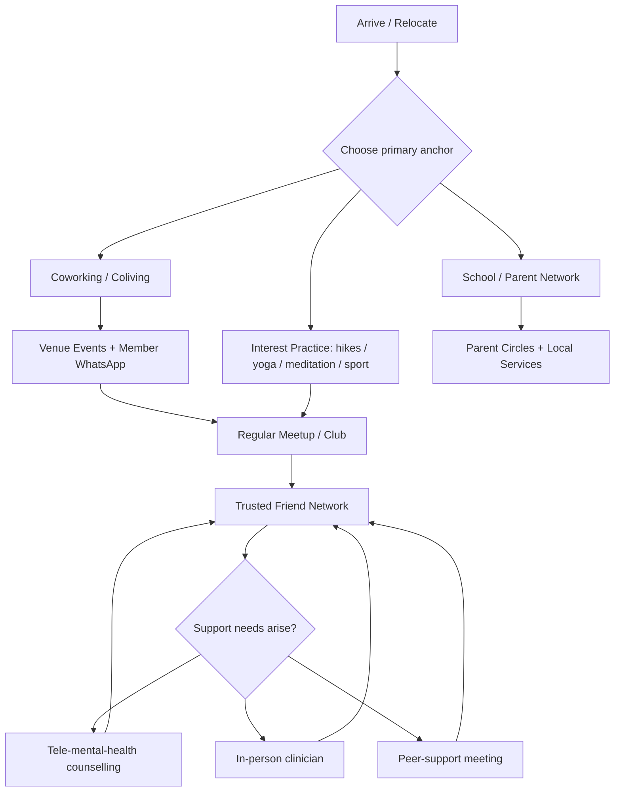

# Community structures and mental-health and social-support resources for remote workers and relocating families in Bir, Dharamshala, McLeodganj, Palampur, Shimla, Solan, Manali and Naggar

## Executive summary

Across these eight Himachal towns, the “connectivity stack” for newcomers tends to be built from (a) coliving/coworking operators that curate social life, (b) a small number of publicly indexed meetups or clubs, and (c) district-level hospitals plus tele-mental-health for counselling and onward referral. In practice, the strongest “plug-in quickly” ecosystems are concentrated in the Dharamshala–McLeodganj belt and in Bir, where multiple coworking/coliving venues explicitly market community and events. citeturn35view0turn34view0turn27view0turn22search5

For mental-health access, you effectively have three tiers:

1. **Tele-mental-health first line (state-agnostic)**: entity["organization","Tele-MANAS","national tele-mental health"] is a Government of India initiative providing free, 24/7 tele-counselling via **14416** (and **1‑800‑891‑4416** in official releases). It is positioned as the digital arm linked to district programmes and escalation pathways. citeturn28search0turn28search4turn28search15  
2. **State helpline overlay (Himachal)**: Himachal’s public materials list Tele-MANAS alongside **health helpline 104** for the state. citeturn30view0  
3. **In-person clinical care (town-dependent)**: Larger centres (notably Shimla, Solan, and the medical-college catchments near Dharamshala/Palampur/Kullu) offer stronger in-person options via government and private facilities; smaller villages rely more on travel + telehealth. citeturn2search2turn37search8turn3search12turn3search19turn2search34

For peer-support recovery groups, publicly indexed listings confirm:

- **AA in McLeodganj (and nearby Kangra district localities)** via the all-India meeting table maintained by entity["organization","Alcoholics Anonymous West Mumbai Intergroup","aawmig meeting list"]. citeturn7view0turn7view1  
- **NA in Bir** and **NA in Kufri (Shimla district)** via a March 2026 NA meeting list PDF for the Society of Indian Region. citeturn12view0turn12view1  

Overall newcomer risk of social isolation is lowest where (i) there is an “always-on” coworking/coliving community with organised activities, and (ii) there is a public meetup pipeline. Risk rises in smaller/seasonal settings (especially Naggar and parts of Manali in off-season) where community is more transient and fewer formal groups are visible.

## Research approach and caveats

This report prioritised primary and official sources (coworking operators’ own sites, district administration pages, medical college/hospital sites, and official helpline pages), then used established directories only where primary sources were missing. citeturn35view0turn17view0turn37search8turn3search12turn28search0

Key caveats:

- **WhatsApp groups are often semi-private** (invites shared after an in-person visit, a booking, or a referral). Where direct invite links were not publicly available, the report provides “how to join” instructions and marks the link as **unspecified**. This pattern is explicit in at least one regional nomad guide, which notes that housing and local networks are often brokered via local WhatsApp groups rather than “online listings”. citeturn31search18  
- **Hours and pricing change frequently**, especially for workation/coliving properties that shift by season; all pricing should be treated as an “as-published” reference point and verified before committing. citeturn33search4turn33search3turn21view0turn22search5  
- Social platform pages were not consistently accessible in full detail during automated collection; in such cases, only information visible in search results or on non-restricted pages is used, otherwise marked **unspecified**.

## Comparative overview across towns

The ratings below are qualitative (High/Medium/Low) and derived from the **observed presence** of coworking venues, publicly discoverable newcomer communities, and verifiable clinical/peer-support touchpoints in sources cited elsewhere in this report.

| Town | Coworking footprint | Public newcomer community signals | In-person mental-health access (local or near) | AA/NA presence (within town/nearby) | Family relocation friendliness (services density) | Social isolation risk for newcomers |
|---|---|---|---|---|---|---|
| Bir | High | Medium | Medium | NA (in town) | Medium | Medium |
| Dharamshala | High | High | High (district + nearby medical college) | Nearby (McLeodganj) | Medium–High | Low–Medium |
| McLeodganj | High | Medium–High | High (shared catchment with Dharamshala) | AA (in town) | Medium | Low–Medium |
| Palampur | Low | Low | High (hospital + nearby services) | Unspecified | Medium–High | Medium |
| Shimla | Medium | Low–Medium | High (medical college) | NA (nearby Kufri) | High | Low–Medium |
| Solan | Medium | Low | Medium (regional hospital + nearby medical college) | Unspecified | Medium–High | Medium |
| Manali | Medium | Low–Medium | Medium–Low (often via Kullu) | Unspecified | Medium | Medium |
| Naggar | Low–Medium | Low | Low–Medium (often via Kullu) | Unspecified | Low–Medium | Medium–High |

## Town profiles and resource directories

### Bir

**Existing coworking spaces**

- entity["local_business","Karyashaala by E Living Project","bir, himachal pradesh, in"]  
  Address: Stain, Bir Colony, Himachal Pradesh **175032**. citeturn22search14  
  Website: listed as a coworking venue on Coworker (space profile). citeturn22search4  
  Hours: unspecified (coworking listing notes 24 access in amenities, but does not publish a formal schedule). citeturn22search4  
  Membership/pricing: Coworker references pricing “from ₹299 per person per day” (as displayed in nearby-space cross-references). citeturn22search5  

- entity["hotel","Bir Nest Hostel","bir, himachal pradesh, in"]  
  Address: “Near Learn Well School, Village Chougan, Bir, Himachal Pradesh 176077, India” (Coworker listing map/address). citeturn22search5  
  Website: Coworker space profile. citeturn22search5  
  Hours: unspecified (Coworker amenities include “24 access”). citeturn22search5  
  Membership/pricing: “From ₹100 per person per day” (as displayed in the listing). citeturn22search5  

- entity["local_business","The Founders Tribe","bir, himachal pradesh, in"] (workation homestay with coworking café)  
  Address: unspecified (site describes proximity “~1 km from Bir market” but does not publish a full postal address on the page). citeturn27view0  
  Website: Solitude Stays page. citeturn27view0  
  Hours: unspecified.  
  Membership/pricing: “budget-friendly long-stay rates” are described but not enumerated. citeturn27view0  
  Contact: Phone numbers are published under the site’s contact block (Solitude Stays / Hotel Sagarmatha contact): **+91 6230686067**, **+91 6230776067**; Email: **thesolitudestays@gmail.com**. citeturn27view0  

- entity["hotel","The Hood Bir Billing","bir, himachal pradesh, in"] (coworking marketed via business listing; hours missing)  
  Address (as listed): Village Stain, P.O. Ahju, Tehsil Mandi, Joginder Nagar/Chauntra area, Himachal Pradesh **175032**. citeturn25view0  
  Website: unspecified (listing indicates “Add website”; official site was not readable in the captured source set). citeturn25view0  
  Hours: unspecified (“Business hours missing” on listing). citeturn25view0  
  Membership/pricing: unspecified.

- entity["local_business","Barefoot Bir Coliving Coworking Cafe","bir, himachal pradesh, in"]  
  Address (as published in a lodging listing): “Barefoot Bir, c/o Om Shanti Guest house, Bir road, Village Stain, District Mandi”. citeturn22search3  
  Website/hours/pricing: unspecified.

**Active community groups and how to join**

- Volunteer/community programmes can serve as a “social onboarding” path. entity["organization","Flashpackers Bir","bir, himachal pradesh, in"] publishes a volunteering programme positioned as “creative volunteering” and community exchange in Bir-Billing; membership/join instructions are on the programme site. citeturn31search23  
- Digital-nomad community in Bir is strongly venue-led (hostel/coworking common spaces, bonfires, shared kitchens). In practice, ask your coworking host for their internal WhatsApp community once you check in (public invite links were not consistently published in collected sources). **WhatsApp link: unspecified**.

**Mental-health resources**

- Primary remote option: Tele-MANAS (free). citeturn28search0turn28search4turn30view0  
- In-person escalation is commonly via the Kangra/Palampur health corridor (see Palampur profile for entity["organization","Vivekananda Medical Institute","palampur, himachal pradesh, in"] psychiatry services). citeturn3search12  
- Private practice options in the wider region exist but are inconsistently documented; where directories were incomplete, language/fees/telehealth specifics are **unspecified**.

**AA/NA or other peer-support groups**

- **NA (Bir)**: The March 2026 NA meeting list includes “Awakening group (New meeting) Bir – HP” at entity["point_of_interest","Deer Park Bir","bir, himachal pradesh, in"], **Friday 16:00**, contact lead “Samir K” **+91 70185 25723**. citeturn12view0  
- **AA (nearest cited)**: AA meetings are listed in McLeodganj (see McLeodganj section) and in Kangra district localities (AA table includes a Kangra listing). citeturn7view0turn7view1  

**Informal social hubs**

Most “third-place” social density in Bir is concentrated in co-living/coworking cafés and hostels, where daytime work blends into evening social rituals (shared meals, bonfires, trek planning). Venue-led community is strongly supported by the way local workation operators describe their offers (cowork + community + food). citeturn27view0turn22search5

**Accessibility for families**

- Childcare: unspecified (no verified provider listings captured for Bir specifically).  
- Schools: unspecified for Bir itself; families often evaluate a wider radius including Baijnath/Palampur for schooling and paediatric access due to stronger town-level services. (This is an inference; confirm locally.)  
- Family-friendly activities: nature/outdoors are abundant; structured “kids clubs” and formal community centres are **unspecified**.

**Social isolation risk and newcomer challenges**

Bir can feel highly social inside a coworking/hostel circuit but quiet outside it, especially in off-season. Newcomers typically face: finding stable housing, navigating connectivity/power backups, and “breaking into” existing micro-communities that revolve around a few venues. Practical integration: choose a venue that runs shared meals and weekly events, attend one volunteer/community programme early, and (if relevant) use NA/AA to anchor recurring connections. citeturn22search5turn31search23turn12view0  

### Dharamshala

**Existing coworking spaces**

- entity["local_business","AltSpace","dharamshala, himachal pradesh, in"] (coliving + coworking campus)  
  Address (as published): “Thehr, Khaniyara Valley, Dharamshala, Himachal Pradesh, India” (no street-level postal line on the captured page). citeturn35view0  
  Website: AltSpace. citeturn35view0  
  Hours: workspace access is positioned as always-available for residents (amenities include high-speed internet and power backup; formal public office hours not specified). citeturn35view0  
  Pricing: published on AltSpace’s pricing page (example: Premium Room daily/weekly/monthly pricing is shown, with workspace access described). citeturn33search4  
  Contact: a public page snippet lists phone **+91 89861 45472** and email **122suraj0@gmail.com**. citeturn33search16  

- entity["local_business","Dharamshala.co Co-working Space","dharamshala, himachal pradesh, in"]  
  Address: unspecified on the coworking page captured. citeturn34view0  
  Website: Dharamshala.co coworking page. citeturn34view0  
  Hours: access model described as “5 working days per week” for listed plans (not a clock-time schedule). citeturn34view0  
  Membership/pricing (GST excluded as stated): Floater Plan ₹5,000/month; Private Cabin (4) ₹15,000/month; Private Cabin (5) ₹18,000/month. citeturn34view0  

**Active community groups and how to join**

- entity["organization","Living in Dharamshala","meetup group"] on Meetup: a publicly discoverable local group for residents/newcomers (hikes, walks, information exchange). Join via Meetup and message the organiser through the platform. citeturn32view0  
- Dharamshala.co promotes activity groups (e.g., a “Dharamshala Chess Club” post indicating a WhatsApp group via QR/invite). Direct invite link is **unspecified** in the captured snippet, but the join mechanism is “scan QR / join WhatsApp group” as announced on their channel. citeturn31search4  

**Mental-health resources**

- Government/medical college access (nearby): entity["organization","Dr. Rajendra Prasad Government Medical College","tanda, himachal pradesh, in"] provides psychiatry services as part of a medical college/hospital catchment; contact and department directory information is published in official materials. citeturn2search34  
- Private neuropsychiatry clinic network (regional): entity["local_business","Ojas Neuropsychiatry Centre","kangra, himachal pradesh, in"] publishes contact details and locations in the region including Dharamshala/Kangra. (Languages/fees/telehealth specifics are inconsistently published in the captured snippet set; mark as **unspecified** unless confirmed directly with the provider.) citeturn2search12  
- Telehealth baseline: Tele-MANAS (14416) and allied helpline resources. citeturn28search0turn28search4turn30view0  

**AA/NA or other peer-support groups**

- No Dharamshala-specific AA/NA listing was captured; however, McLeodganj AA listings and the broader Kangra-district AA listing are near enough to function as practical options depending on where you live (see McLeodganj section). citeturn7view0turn7view1  

**Informal social hubs**

In Dharamshala, coworking/coliving venues explicitly frame themselves as community ecosystems, often supporting meetups and workshops; this matters because it substitutes for a sparse public directory of clubs. citeturn35view0turn34view0

**Accessibility for families**

- Childcare: unspecified.  
- Schools: unspecified (verify catchment and commuting lines if staying in upper vs lower zones).  
- Family-friendly activities: outdoor walks and low-cost nature activities are prominent (as described in workation narratives), but formal family services are unevenly documented. citeturn35view0  

**Social isolation risk and newcomer challenges**

Dharamshala is one of the easier locations to integrate into quickly because it has both a coworking ecosystem and at least one public meetup pathway. citeturn35view0turn32view0 Newcomer friction points centre on housing search, transport between upper/lower areas, and building routine once the novelty fades. A robust plan is to anchor yourself in one “recurring room”: pick a coworking space with events, attend a Meetup walk/hike, and schedule one weekly co-working “social hour” even if you prefer to work alone.

### McLeodganj

**Existing coworking spaces**

- entity["restaurant","The Other Space: illiterati Art and Co-work","mcleodganj, himachal pradesh, in"]  
  Address: unspecified on the captured official site home page; the venue is consistently described as adjacent to Illiterati in the Jogibara area (secondary sources). citeturn33search2turn33search10  
  Website: Illiterati Art & Co-work site. citeturn33search2  
  Hours: an official social profile snippet indicates “⏰ 9–9” (verify seasonally). citeturn33search6  
  Day-use pricing signal: a TripAdvisor review describes a day-work offer (~₹300 including Wi‑Fi for the day plus a beverage). Treat as indicative; verify directly with the venue. citeturn33search10  

- entity["local_business","The VOID Life","mcleodganj, himachal pradesh, in"] (Bhagsu/Dharamkot area workation property marketed as coliving + coworking)  
  Website: The Void Life. citeturn33search11  
  Monthly package pricing: “starting from ₹36k/month for 28 nights” including room + free coworking + events/community access (tax excluded as stated). citeturn33search3  
  Hot desk/day pass pricing signal: a workspace directory entry lists hot desk memberships starting at ₹150/day and shows 24-hour timings on weekdays/Saturdays (secondary listing; verify). citeturn33search30  
  Address: a travel booking listing flags Bhagsu Nag / McLeod Ganj location details for a “VOID” stay-and-work property; confirm the exact worksite address with the operator. citeturn33search18  

**Active community groups and how to join**

- The “Living in Dharamshala” Meetup group also implicitly covers McLeodganj/Upper Dharamshala residents (the page states “in and around Dharamshala”). Join and message via Meetup. citeturn32view0  
- Many McLeodganj social circuits are venue-centric: cafés with workspaces + hostel events + meditation/yoga centres. One practical join method is to ask your coworking venue for their internal WhatsApp community list (public invite links are frequently not posted).

**Mental-health resources**

McLeodganj shares the same practical in-person catchment as Dharamshala (district-level services, private clinics in the wider Kangra area, and tele-mental health). citeturn2search12turn2search34turn28search0turn30view0

**AA/NA or other peer-support groups**

- **AA in McLeodganj**: The all-India AA meeting table lists:  
  - “Back To Basics Group” at entity["place","Yong Ling School","mcleodganj, himachal pradesh, in"], Sagibera Road, McLeodganj; day/time is shown as “Thu 5.00 pm & 12.00 noon”; contact “Todd M.” with phone **018922 20789** (format as published). citeturn7view0  
  - It also lists “The Mclordgang Group” at entity["place","Loling School","mcleodganj, himachal pradesh, in"] with a Wednesday 5.00 pm listing and the same contact number. citeturn6view0  
  Treat the schedule formatting as “as-published”; confirm locally.  

- NA: no McLeodganj-specific NA meeting was identified in the captured NA meeting list; nearest verified NA listings in this report are in Bir and Kufri (see those sections). citeturn12view0turn12view1  

**Informal social hubs**

- entity["point_of_interest","Dhamma Sikhara","dharamkot, himachal pradesh, in"] (Vipassana centre) operates scheduled meditation courses above McLeodganj near Dharamkot; this is a high-structure, high-social-capital environment for newcomers seeking routine and community. citeturn4search23  
- Work-friendly café hubs: AltSpace’s blog highlights venues such as The Other Space and other cafés in McLeod Ganj as common remote-work “social offices”. citeturn33search29  

**Accessibility for families**

- Childcare and schools: unspecified in captured sources; McLeodganj’s housing stock and road gradients can create pram/elder mobility friction (inference—verify in-person).  
- Activities: strong outdoors and cultural programming (meditation centres, cafés, trails) but fewer captured “formal parenting circles” in public listings.

**Social isolation risk and newcomer challenges**

McLeodganj is easy to meet people in if you adopt the “third place” strategy (coworking café by day, one recurring activity by evening). The main challenges are managing tourist-season crowding and maintaining stable routines when neighbours rotate weekly. Recurring anchors (AA, meditation courses, a weekly cowork session) reduce churn-driven isolation. citeturn7view0turn4search23turn33search3turn33search29  

### Palampur

**Existing coworking spaces**

Dedicated coworking spaces with primary/official listings in captured sources were **not identified** for Palampur. Workation-friendly accommodation options exist (e.g., “WFH homestay” positioning), but these are not equivalent to a coworking operator with memberships and a community programme. citeturn14search34  
Coworking: **unspecified**.

**Active community groups and how to join**

Publicly indexed digital-nomad or expat groups specific to Palampur were **not identified** in captured sources. In practice, newcomer networks often route through schools, neighbourhood associations, or hobby groups rather than nomad meetups; links: **unspecified**.

**Mental-health resources**

- entity["organization","Vivekananda Medical Institute","palampur, himachal pradesh, in"] lists psychiatry services/department information and publishes contact access via its website; this is a key in-person mental-health anchor for the Palampur corridor. citeturn3search12  
- Tele-MANAS (14416) and Himachal helpline overlay (104) remain the most reliable “front door” for immediate counselling and referral. citeturn28search0turn30view0  
Fees/languages/telehealth at local providers: largely **unspecified** in the captured public pages.

**AA/NA or other peer-support groups**

No Palampur-specific AA/NA meeting listing was captured in the cited AA/NA directories; nearest verified meetings in this report are in Bir (NA) and McLeodganj (AA). citeturn12view0turn7view0  

**Informal social hubs**

Palampur’s social hubs are likely to skew towards cafés and local institutions rather than nomad cafés (not enough verified listings captured to name specific venues; **unspecified**).

**Accessibility for families**

Relative to smaller villages, Palampur is generally more “family-town shaped” (healthcare and daily-life services), but specific childcare/school listings were **not captured** in the source set. Schools/childcare: **unspecified**.

**Social isolation risk and newcomer challenges**

For relocating families, challenges are typically less about meeting tourists and more about building local continuity (schools, neighbours, hobby networks). For remote workers, the main risk is the absence of a dedicated coworking scene (in the captured sources), which increases dependence on self-constructed routines and travel to nearby hubs for community.

### Shimla

**Existing coworking spaces**

- entity["company","MyBranch","coworking operator india"] location in Shimla (SDA Complex)  
  Address: 4th Floor, Block No. 18B, SDA Complex, Kasumpti, Shimla, Himachal Pradesh **171009**. citeturn17view0  
  Website: MyBranch “Coworking Space in Shimla” page. citeturn17view0  
  Phone: **+91 8451999506** (as published on the page). citeturn17view0  
  Hours: unspecified on MyBranch page; a workspace aggregator listing for this location reports 9:00 am–7:00 pm weekday/Saturday and closed Sunday (secondary; verify). citeturn16search1  
  Pricing: general “starting from” pricing is published on MyBranch’s broader site, but Shimla-specific membership pricing is **unspecified** on the captured Shimla page. citeturn16search2turn17view0  

- “Shimla Coworking” (Khalini) appears in office-rental directories with a physical address line, but an official operator site was not identified in captured sources. Treat this as a serviced-office listing rather than a verified community coworking operator. citeturn14search25  
  Address (as listed): 1st floor, Chauhan Niwas, Khalini, Near Khalini Market, Shimla, Himachal Pradesh **171002**. citeturn14search25  
  Website/hours/pricing: **unspecified** in primary sources; directory sites show indicative pricing. citeturn14search14turn14search25  

**Active community groups and how to join**

Town-specific expat/nomad/parenting groups were **not confirmed** in captured sources. Given Shimla’s larger resident base and institutional density, newcomer integration often routes through: workplace networks, school parent groups, neighbourhood clubs, and city cultural events (links: **unspecified**).

**Mental-health resources**

- entity["organization","Indira Gandhi Medical College","shimla, himachal pradesh, in"] has a Department of Psychiatry and publishes department information and telephone directory details on official pages. citeturn2search2turn2search14  
- Tele-MANAS and Himachal helpline overlay remain available for counselling and referral. citeturn28search0turn30view0  

**AA/NA or other peer-support groups**

- **NA (near Shimla, Kufri)**: The NA meeting list includes “Recovery Foundation Group” at entity["place","Ashray Cottage","kufri, himachal pradesh, in"], Kufri (Shimla district), **Tuesday 18:30** and **Friday 18:30**, helpline **+91 86270 99111**. citeturn12view1  
- AA in Shimla proper was not found in the captured AA meeting list (nearest verified entries in the AA table are elsewhere in Himachal such as McLeodganj and Kangra district localities). citeturn7view0turn7view1  

**Informal social hubs**

Specific public listings for “community hubs that host gatherings” were not captured for Shimla; however, institutional venues (universities, theatres, civic grounds) are typical focal points (details: **unspecified**).

**Accessibility for families**

Shimla is structurally the most family-services-dense town in this set (capital-city effect), but childcare/school names, admissions contacts, and fee ranges were not captured in the current sources and are therefore **unspecified**.

**Social isolation risk and newcomer challenges**

In Shimla, isolation risk is more likely to be driven by neighbourhood fragmentation (living far from peers due to housing costs or school zones) than by lack of people. A best-practice integration plan is to build three circles: school/child activities, a hobby community, and a work-network anchor (coworking or professional association).

### Solan

**Existing coworking spaces**

- entity["local_business","Kapacity Coworking","solan, himachal pradesh, in"]  
  Address: Kapoor Complex, The Mall / Mall Road, Solan, Himachal Pradesh **173212** is consistently cited as the location in multiple public records and business contact pages. citeturn19view0turn20search4  
  Website: no official operator site was confirmed in captured sources; social page access was inconsistent. Website: **unspecified**. citeturn20search0  
  Hours (directory listing): Monday–Friday 09:30–19:00; Saturday 09:00–19:30; Sunday closed (secondary directory; verify). citeturn21view0  
  Membership/pricing: **unspecified** in captured sources.

**Active community groups and how to join**

Solan-specific expat/nomad groups were **not identified** in captured sources. A noteworthy institutional community anchor is the university ecosystem.

**Mental-health resources**

- entity["organization","Regional Hospital, Solan","solan, himachal pradesh, in"] (district administration listing)  
  Phone (Medical Superintendent): **01792-223638**. citeturn37search8  
  Psychiatry OPD specifics: **unspecified** on the district listing page; confirm with the hospital.

- entity["organization","Maharishi Markandeshwar Medical College & Hospital","kumarhatti, himachal pradesh, in"]  
  A psychiatry department page exists on the institution site (service description published; detailed access pathway/OPD hours not captured in the snippet). citeturn37search13  
  Institutional phone details and campus-level numbers are published in MMU documents (for example, +91-1792-262111 is shown in an MMU PDF header). citeturn37search3  

- entity["organization","Shoolini University","solan, himachal pradesh, in"]  
  The university publishes a “mental health support” page describing a **24x7 counselling helpline** for students, and publishes contact numbers for the institution. This is primarily a student service rather than a general-public clinic, but it can indirectly support relocating families with university-affiliated members. citeturn37search10turn37search2  

- Tele-MANAS and Himachal helpline overlay remain the most universal “first contact” options. citeturn28search0turn30view0  

**AA/NA or other peer-support groups**

No Solan-specific AA/NA meeting listing was captured in the referenced AA/NA directories; nearest verified options in this report are Shimla district (Kufri NA) and McLeodganj AA, depending on travel feasibility. citeturn12view1turn7view0  

**Informal social hubs**

Solan’s social networking tends to be institution-driven (universities, hospitals, Mall Road businesses). Specific “hosted gatherings” venues were **unspecified** in captured sources.

**Accessibility for families**

Solan generally has strong baseline services for families due to its urban and university catchment; childcare/school provider specifics: **unspecified**.

**Social isolation risk and newcomer challenges**

Solan’s coworking footprint appears thinner than Dharamshala’s but stronger than smaller villages; challenges for newcomers are often about finding the “right circle” (work peers vs local families vs students). Using a coworking venue plus a recurring hobby class is a practical integration strategy.

### Manali

**Existing coworking spaces**

- entity["local_business","Seekers CoWork and Stay","manali, himachal pradesh, in"]  
  Address: listed only as “Unnamed Road” in the Coworker profile map section (detailed street address not published in the captured view). citeturn36view0  
  Website: Coworker listing (primary operator site not identified in captured sources). citeturn36view0  
  Hours: described as a 24*7 coworking space, and the amenities include “24 access”. citeturn36view0  
  Membership/pricing: **unspecified** in the captured portion of the listing.  
  Operational features: multiple high-speed internet connections (300 Mbps+), power backup and workspace amenities are described. citeturn36view0  

- entity["local_business","Alt Life Manali","manali, himachal pradesh, in"]  
  Address: “Clubhouse Road” (as listed under nearby spaces in Coworker). citeturn36view0  
  Pricing signal: “From ₹300 per person per day” (as listed). citeturn36view0  
  Website/hours: unspecified in captured sources.

**Active community groups and how to join**

Public, joinable groups specific to Manali (digital nomad/women/parenting) were not captured in sources. Community tends to be seasonal and venue-led (workation properties, hostels, cafés). For structured community, prioritise a coworking-coliving space that runs daily/weekly events.

**Mental-health resources**

- entity["organization","Regional Hospital Kullu","kullu, himachal pradesh, in"] is the key in-person referral anchor for the Manali/Naggar area in captured sources; the hospital lists service lines including **Drug De-addiction Services** and publishes contact information. citeturn3search19  
- Tele-MANAS and Himachal’s helpline overlay provide immediate counselling and referral guidance. citeturn28search0turn30view0  

**AA/NA or other peer-support groups**

No Manali-specific AA/NA meeting listing was identified in the captured AA/NA directories. Tele/online AA/NA pathways exist, but local in-person meeting details are **unspecified** in captured sources. citeturn28search0turn4search20  

**Informal social hubs**

Work-friendly hostels/cafés and outdoor-activity communities are common in Manali’s remote-work narratives; however, specific named hubs with verified “host gatherings” listings were **unspecified** in captured sources.

**Accessibility for families**

Manali is tourism-oriented; family services often depend on neighbourhood and season. Childcare/schools: **unspecified**. Families typically need a stronger plan for winter mobility, healthcare escalation to Kullu, and steady routines.

**Social isolation risk and newcomer challenges**

Manali is socially “easy mode” in peak season and can shift to “quiet mode” in off-season. Newcomers often underestimate how much their social life depends on venue programming; choose a base with events and schedule recurring activity blocks to stabilise your network. citeturn36view0turn3search19  

### Naggar

**Existing coworking spaces**

- entity["company","NomadGao","coliving operator india"] property listing: entity["local_business","Plum Paradise","naggar, himachal pradesh, in"] (coliving/coworking near Naggar)  
  Address: described as “near Naggar” (full postal line not published in the captured search snippet). citeturn1search31  
  Website: NomadStays/nomad listing page. citeturn1search31  
  Membership/pricing: published as “from ₹750/day” and “from ₹12,999/week” (as shown in listing snippet). citeturn1search31  
  Hours: unspecified (typical for coliving packages).

**Active community groups and how to join**

- NomadGao publishes an events page describing workshops/activities across its locations (useful for structured connection pathways). citeturn31search21  
- Public local parenting/women’s circles for Naggar were not captured; links: **unspecified**.

**Mental-health resources**

Naggar generally routes to the same in-person healthcare corridor as Manali, with district-level services documented in Kullu. Tele-MANAS and Himachal helpline overlay remain the most reliable first-contact channels. citeturn3search19turn28search0turn30view0  

**AA/NA or other peer-support groups**

No Naggar-specific AA/NA listings were captured; nearest verified NA listing in this report is in the Kullu–Shimla corridor (Kufri) and Bir (for NA), and McLeodganj (AA). citeturn12view0turn12view1turn7view0  

**Informal social hubs**

Naggar’s social ecosystem is often anchored by the property/community you choose (coliving cohort effects). Without a cohort, social networks can be sparse and highly dependent on existing friendships.

**Accessibility for families**

Childcare/schools: **unspecified**. For families, Naggar often requires a more deliberate planning posture (healthcare escalation, transport, and consistent schooling options), with some families preferring larger service centres.

**Social isolation risk and newcomer challenges**

Naggar has one of the higher isolation risks for newcomers if you do not enter via a community-led venue. The most practical strategy is to treat coliving/coworking as “community infrastructure” rather than just accommodation: commit to daily shared meals or events for the first two weeks, then layer in one outward-facing activity (hiking club, volunteering, or a recurring class).

## Newcomer connection pathways and integration recommendations

A practical “connection funnel” that works across all eight towns is to create redundancy: one work-community anchor, one interest-based anchor, and one wellbeing anchor (clinical or peer-support). The following flowchart shows a robust pathway that can be adapted per town.

**Cross-town recommendations (high leverage, low regret)**

- Use Tele-MANAS early if you are struggling, rather than waiting until distress is acute; it is positioned as free, 24/7, and designed to connect callers to escalated professional care when needed. citeturn28search0turn28search4turn28search15  
- If substance-use recovery support matters, prioritise towns with verified in-person meetings (McLeodganj AA; Bir NA; Kufri NA) or be prepared to use online/tele pathways when local meetings are absent. citeturn7view0turn12view0turn12view1  
- For remote workers, **pick one venue that is explicitly community-designed** (AltSpace / similar) if you are moving solo; the social design reduces the “cold start” problem. citeturn35view0turn36view0turn27view0  
- For relocating families, treat “how do we form routine?” as the central integration question. In towns where formal parenting circles are not visible publicly, your fastest route is typically through school communities and neighbourhood networks (public links often not available).

## Source annotations and gaps

- **Most complete public coworking information** was found for AltSpace (including location description and pricing), Dharamshala.co (plans and price points), and the Coworker listings (Bir Nest/Karyashaala/Seekers). citeturn35view0turn33search4turn34view0turn22search5turn36view0  
- **Most complete official mental-health access points** are via Tele-MANAS (official portal + official PIB explanations) and government hospital/medical college pages in Shimla and Solan. citeturn28search0turn28search4turn2search2turn37search8turn30view0  
- **Women’s groups, parenting circles, and town-specific WhatsApp/Telegram groups** were frequently not publicly linkable in the captured sources; where absent, they are marked **unspecified** and should be pursued via on-the-ground referrals (coworking hosts, school admins, clinicians, and long-stay residents).
map